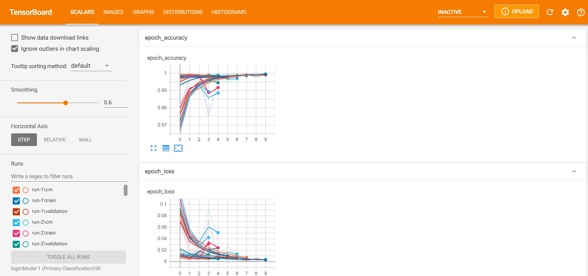
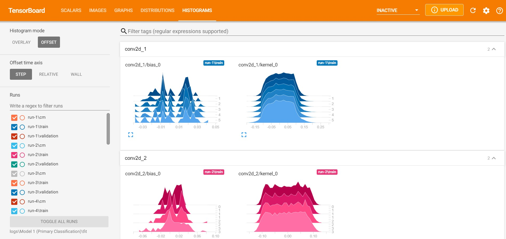
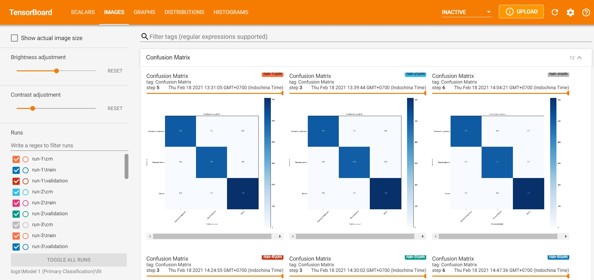
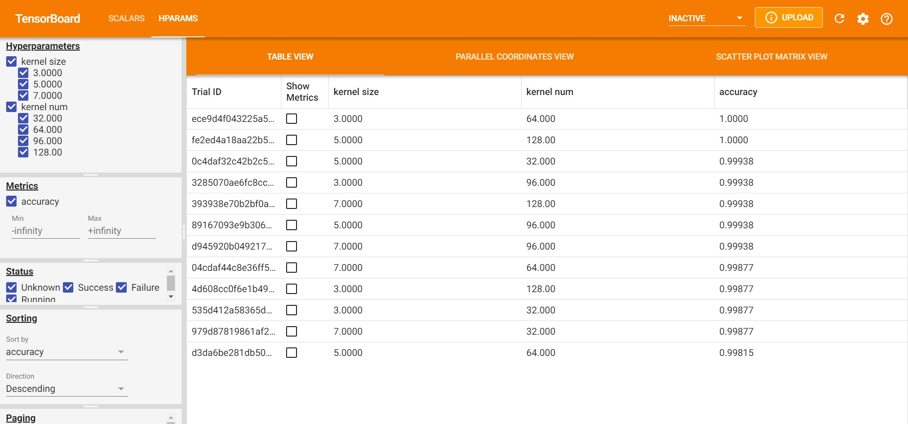

# Fashion Shop Images Classification

## Important notes before getting started
- If you wish to download <b>dataset</b>, pleae download from here: https://drive.google.com/file/d/1hX7gIACOXYWMfxgvTR55zQSidXoLcxIo/view?usp=sharing
- If you wish to download <b>trained saved models</b>, pleae download from here: https://drive.google.com/file/d/18GY5b6f9qKRSJOw0qlLb7eig9Zb2zfO9/view?usp=sharing
- If you wish to download and run the .ipynb files, please <b>change the directory of all files load functions</b>, otherwise it's not going to work

## Project Overview
&nbsp;&nbsp;&nbsp;&nbsp;We are trying to automate the labeling process of an online fashion shop which sells 3 main product categories which are <b>Trousers&Jeans, Shoes, and Glasses&Sunglasses</b>. This is the best fit to do images classification with CNN. Trousers&Jeans and Shoes both have sublabels for <b>'male'</b> and <b>'female'</b>. Moreover, 
Shoes is the most complex one, it can be subcategorized into <b>'Boots', 'Trainers/Sneakers', 'Sandals/Flip flops/Slippers', 'Formal shoes','Others'</b> under <b>'male'</b> category, and <b>'Boots', 'Ballerina', 'Trainers/Sneakers','High heels', 'Sandals/Flip flops/Slippers', 'Others'</b> under <b>'female'</b> category.  
&nbsp;&nbsp;&nbsp;&nbsp;So overall, this is a multi-classes muti-labels problem. In this project, We have tried 2 different approaches, which are Combined and Hierarchical, for those categories having subcategories. Combined approach is to combine all possible combination labels into a single classes example 'Boots' under 'male' will be combined in to 'Boots male' as 1 label, and so on.
Hierarchical approach is to train the separated model to perform different tasks, for example, first we classify whether its 'male' or 'female', if it's male, which of 5 labels in male shoes it is belong to.
  
## Results
### Accuracy
- Primary_Classification -> Validation accuracy: **100%**, Test accuracy: **99.75%**
- Glasses&Sunglasses -> Validation accuracy: **96.40%**, Test accuracy: **95.60%**
- Shoes_All_Dropout -> Validation accuracy: **76.20%**, Test accuracy: **75.12%**
- Shoes_Gender_L2 -> Validation accuracy: **83.50%**, Test accuracy: **82.23%**
- Shoes_Male_L2 -> Validation accuracy: **88.20%**, Test accuracy: **87.64%**
- Shoes_Female_L2 -> Validation accuracy: **89.90%**, Test accuracy: **85.28%**
- Trousers&Jeans_All -> Validation accuracy: **77.40%**, Test accuracy: **76.20%**
- Trousers&Jeans_All_L2 -> Validation accuracy: **74.80%**, Test accuracy: **74.60%**
- Trousers&Jeans_All_Dropout -> Validation accuracy: **72.20%**, Test accuracy: **73.60%**
- Trousers&Jeans_Gender -> Validation accuracy: **90.80%**, Test accuracy: **90.60%**
- Trousers&Jeans_Male -> Validation accuracy: **89.60%**, Test accuracy: **87.20%**
- Trousers&Jeans_Female -> Validation accuracy: **84.00%**, Test accuracy: **86.00%**
### Best Hyperparameters for each model
- Primary_Classification -> kernel_size: **3**, kernel_num: **64**
- Glasses&Sunglasses -> kernel_size: **5**, kernel_num: **64**
- Shoes_All_Dropout -> kernel_size: **5**, kernel_num: **128**, dropout_rate: **0.4**
- Shoes_Gender_L2 -> kernel_size: **5**, kernel_num: **64**, lambda: **1x10^-4**
- Shoes_Male_L2 -> kernel_size: **3**, kernel_num: **64**, lambda: **1x10^-4**
- Shoes_Female_L2 -> kernel_size: **5**, kernel_num: **64**, lambda: **1x10^-5**
- Trousers&Jeans_All -> kernel_size_1: **7**, kernel_size_2: **3**, kernel_num: **96**, dense_size: **512**
- Trousers&Jeans_All_L2 -> kernel_size_1: **7**, kernel_size_2: **3**, kernel_num: **96**, dense_size: **512**, lambda: **1x10^-5**
- Trousers&Jeans_All_Dropout -> kernel_size_1: **7**, kernel_size_2: **3**, kernel_num: **96**, dense_size: **512**, dropout_rate: **0.4**
- Trousers&Jeans_Gender -> kernel_size_1: **3**, kernel_size_2: **5**, kernel_num: **128**, dense_size: **512**
- Trousers&Jeans_Male -> kernel_size_1: **3**, kernel_size_2: **3**, kernel_num: **64**, dense_size: **256**
- Trousers&Jeans_Female -> kernel_size_1: **3**, kernel_size_2: **3**, kernel_num: **128**, dense_size: **256**
### Combined model vs Hierarchical model
&nbsp;&nbsp;&nbsp;&nbsp;We evaluated the score by manual loop counting; If the model classify Gender correctly, it will get 1 score. Then if it classify Label correctly, it will get another 1 score. Here is the result both:  
***You can take a look in more detail how we did this in Compare_Combined_and_Hierarchical.ipynb***  
- Trouers&Jeans -> Combined Model: **869** points, Hierarchical Model: **868** points (No difference)
- Shoes -> Combined Model: **981** points, Hierarchical Model: **991** points (Hierarchical Model performs about **10%** better)
### Hyperparameters tuning processes with TensorBoard
&nbsp;&nbsp;&nbsp;&nbsp;During Hyperparameters process, we used TensorBoard to visualize all of the result from each values each epoch and we also plotted the confusion matrix with sklearn and show on TensorBoard. This is from one of them:  
  
  
  
  
## Dataset
***Please refer to 'dataset' on Google Drive for full data***  
&nbsp;&nbsp;&nbsp;&nbsp;We've already converted the images into ndarray and save them to **.npz** for ease of use and fast processing. You can refer to the file **'Convert_img_to_ndarray.ipynb"** how we did this conversion. Furthermore, for **shoes category**, before we train/val, we need to do **data augmentation** too because shoes have a direction that they are pointing to, if we didn't do any augmentation when it see the real world images in the different direction, it will have trouble classifying them. We provide some examples of our images data in **'Sample images (Full size)'** folder.  
Here are some examples:  

## Plan to attack
1. Create **Primary Classification** model which aims to classify whether images are 'Trousers&Jeans' or 'Shoes' or 'Glasses&Sunglasses'.
2. Create all of model to classify further down in each class both **combined and hierarchical** approach.
3. If it is Glasses&Sunglasses, we will use **Glasses&Sunglasses classification** model which aim to classify 'Glasses' or 'Sunglasses'. (There is no gender specific for glasses)
4. If it is Shoes, we will use **Shoes_Gender model** to classify whether it's male or female. Then, we will use **Shoes_Male** and **Shoes_Female** model to classify which type of shoes.
5. If it is Trousers&Jeans, we will use **Trousers&Jeans_Gender model** to classify whether it's male or female. Then, we will use **Trousers&Jeans_Male** and **Trousers&Jeans_Female model** to classify which type of shoes.
6. Step 3 to 5 are hierarchical approach. Now, we will use combined approach. After the primary classification, we will apply those label to its combined classification model <b>(name in *_All.ipynb)</b> to classify its labels.
7. Compare combined and hierarchical approach, which one will perform better.
8. Try <b>different model Architecture</b>.
9. Do <b>hyperparameter tuning</b>.

## Libraries
numpy, tensorflow, sklearn, PIL, matplotlib  

## Files explanation
&nbsp;&nbsp;&nbsp;&nbsp;All the files are named with descriptive naming convention. However, to be clear, we have included this part here. (We recommend to ingore the number after the Model_. It might be a bit confusing. It's there for training and testing many different models for each specific task.)  
- **Convert_img_to_ndarray.ipynb** demonstarte how we converted image to ndarray and save to .npz.
- In **Sample images (Full size)** folder, you can find some sameple images of our dataset.
- In **logs** folder, you can find all the different hyperparameters tuning files for each models. You even can run TensorBoard on those subfolders to see the results.
- **Primary_Classification_Model_1_CNN.ipynb** is the file that we train Primary classification model to classify Trousers&Jeans / Shoes / Glasses&Sunglasses
- **Glasses_Sunglasses_Classification_Model_CNN.ipynb** is for classifying Glasses and Sunglasses
- For Trousers&Jeans and Shoes models, like we said before, we built with 2 different approaches. You can find Trousers&Jeans with **Combined approach** in **Trousers&Jeans_Combined_Models** folder and **Hierarchical approach** in **Trousers&Jeans_Hierarchical_Models** folder. For shoes, since we tried only 1 model for combined approach, unlike trousers&jeans we tried 3, we keep both 2 approaches in **Shoes_Models** folder.
- **Compare_Combined_and_Hierarchical.ipynb** is for we calculate and compare scores for those 2 approaches whether which one give the best results.
- **Test_all_models.ipynb** we test all of the models with our test set in there.  

## All model architecture we tried
***We used 'relu' for all layers except the output layers which 'softmax' is used.***
1. Conv -> MaxPool -> Conv -> MaxPool -> Flatten -> Dense
2. Conv -> MaxPool -> Conv -> MaxPool -> Flatten -> Dense -> Dense
3. Conv -> MaxPool -> Conv -> MaxPool -> Flatten -> Dense -> Dropout -> Dense  
<b>We also apply L2 to some models. Please check .ipynb files for each model if you wish</b>

## Problems we found in this project
&nbsp;&nbsp;&nbsp;&nbsp;There is only one main big problem occurred when we test our model with test set. It appeared to predict everything wrong with .evaluate() function. However, when we tried using .predict() function it appears to be fine. So, we went for .predict() and write a code to calculate it manually.

# Thank you for reaching out and read til the end. You are AMAZING. :D
